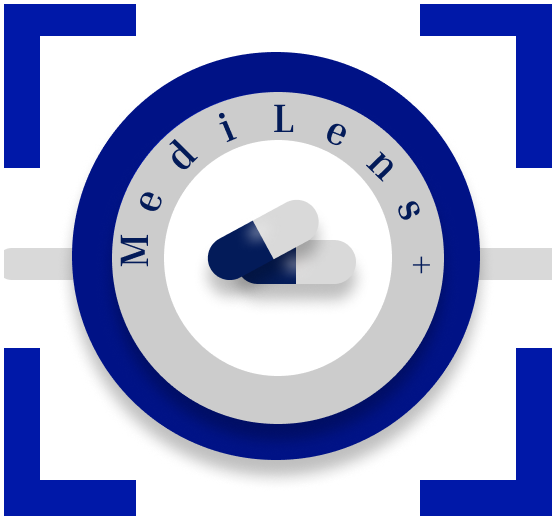

# MediLens+
#### Scan, understand, and manage medical prescriptions with ease — powered by smart document analysis and intuitive design.

  

---

## ⚡ At a Glance

**A secure, AI-powered mobile app that turns messy medical prescriptions into clear, actionable insights — instantly.**

---

## 🩺 About MediLens+

**MediLens+** is a mobile-first healthcare utility app designed to bridge the gap between complex medical documents and patient understanding. Built with simplicity and precision in mind, it enables users to scan prescriptions, labels, or handwritten medical notes using their phone camera and instantly extract relevant medical data.

Through intelligent document processing, OCR (Optical Character Recognition), and secure data handling, MediLens+ transforms cluttered prescriptions into structured, readable insights. Whether it’s dosage info, drug names, or special instructions — users receive real-time interpretation, with clarity.

The app is designed for patients, caregivers, and healthcare professionals seeking a fast, secure, and intelligent way to manage prescriptions on the go. With a clean UI and robust backend, MediLens+ ensures medical data is not only readable — but **protected**.

This project reflects strong attention to design, user experience, and healthcare-specific problem-solving — blending technology with empathy to deliver real-world impact.

---

## ✨ Features

| Feature                           | Description                                                                 |
|----------------------------------|-----------------------------------------------------------------------------|
| 🔍 Smart Prescription Scanning    | Scan handwritten or printed prescriptions using the device camera.          |
| 🧠 Real-time OCR & Text Recognition | Extracts medical text instantly using on-device OCR (Google ML Kit).        |
| 💊 AI-Powered Interpretation      | Identifies drug names, dosages, and key medical instructions.               |
| 🔒 Secure Data Handling           | Data is encrypted and stored securely on-device or in the cloud.            |
| 🎯 Clean & Minimal UI             | Designed for ease of use across age groups and medical familiarity.         |
| 🌙 Dark Mode Support              | Available for better visibility in low-light environments.                  |
| 📶 Offline Functionality          | Works even without internet connection using secure local caching.          |
| 🗂 Scan History                   | Access previous scans instantly via encrypted local storage.                |
| ☁️ Multi-Device Sync *(Planned)* | Sync data across devices securely using cloud integration.                  |
| 🌍 Multilingual Support *(Planned)* | Scan and interpret prescriptions in various languages.                    |
| ⏰ Medication Reminder *(Planned)* | Schedule alerts and notifications for timely intake.                      |
| 🔗 Health Data Integration *(Planned)* | Integration with Apple HealthKit / FHIR APIs.                        |

---

## 🧰 Tech Stack

MediLens+ is built with a **secure, scalable, mobile-first stack** tailored for real-world healthcare challenges.

| Layer                    | Tech / Service                                                                 |
|--------------------------|-------------------------------------------------------------------------------|
| 💻 Development           | [Visual Studio Code](https://code.visualstudio.com/) — development + debugging |
| 🎨 UI/UX Design          | [Figma](https://figma.com) — responsive wireframes and user flow design        |
| 📱 Mobile Framework      | [React Native (Expo)](https://expo.dev/) + TypeScript — cross-platform app     |
| 🔤 OCR Engine            | [Google ML Kit](https://developers.google.com/ml-kit) — fast, on-device OCR    |
| 🧠 AI Interpretation     | Custom NLP parser — prescription parsing & insight extraction                  |
| 🔐 Auth                  | [Firebase Auth](https://firebase.google.com/products/auth) — secure, biometric-ready |
| ☁️ Cloud Database        | [Firebase Firestore](https://firebase.google.com/products/firestore) — encrypted NoSQL |
| 🖼 Image Storage         | [Firebase Storage](https://firebase.google.com/products/storage) — secure uploads |
| 📦 Local Storage         | [Expo Secure Store](https://docs.expo.dev/versions/latest/sdk/securestore/) — encrypted, offline-first |
| 🧩 Backend Logic *(Planned)* | [Firebase Functions](https://firebase.google.com/docs/functions) — serverless cloud logic |
| 🛡 Data Security         | End-to-end AES-256 encryption, HTTPS, zero developer data access               |
| 📋 Compliance Ready      | HIPAA/GDPR-aligned architecture with privacy-by-design principles              |

---

## 🧠 Architecture & Design Decisions

MediLens+ emphasizes modularity, security, and real-world performance — ideal for handling sensitive medical data on mobile devices.

### 🧱 App Structure
- **Modular architecture (React Native + TypeScript)**
- **Feature-first foldering**: Scan, Results, History, etc.
- **Unidirectional state flow** with Context API
- **Secure, offline-first experience** using Expo Secure Store

### 🎨 Design Principles
- **Minimalist interface**: Zero clutter, high legibility
- **Accessibility-aware**: High-contrast, scalable fonts
- **User-centered UX**: Built for patients, caregivers, doctors

### 🔐 Security Highlights
- **End-to-End Encryption (AES-256)** in storage and transit
- **No developer access** to user medical data
- **Granular Firestore rules (planned)** for per-user access
- **Local-only data control**: Nothing leaves the device without permission

### ☁️ Cloud & Deployment
- **Firebase-first** strategy for seamless auth, storage, and sync
- **Zero-trust architecture**: All requests validated with secure rules
- **Serverless cloud functions** *(future)* for NLP, analytics, reminders

### 🔭 Future-Proofing
- Hooks ready for drug APIs, wearable sync, and caregiver sharing
- Designed with **HIPAA/GDPR compliance** in mind

---

## 📸 Screenshots

> *Coming soon.*  
Once development progresses, expect images of:
- The camera scan screen  
- Parsed results UI  
- Scan history  
- Onboarding walkthrough

---

## 🛠 Installation / Run Locally

> *To be added post MVP build.*

Will include:
- Prerequisites (Node.js, Expo CLI, Firebase setup)
- Steps to clone, configure, and run on Android/iOS

---

## 🤝 Contributing

> Currently in **private development**, but contributions may open up post v1 launch.

If you're interested in:
- Privacy-first healthcare apps  
- OCR/NLP on mobile  
- Contributing to healthcare access

Feel free to fork, submit ideas via issues, or connect.

> ⚠️ This app will be live on iOS and Play Store soon. Contributions must align with privacy and security guidelines.

---

## 👤 Author

**Developer & Designer**  
**Shivoshita Jhalta**  

📎 [LinkedIn](https://www.linkedin.com/in/shivoshita-jhalta)  
📧 [shivoshita@gmail.com](mailto:shivoshita@gmail.com)  
> You can also reach out via GitHub issues for app-related discussions or collaboration opportunities. 

---